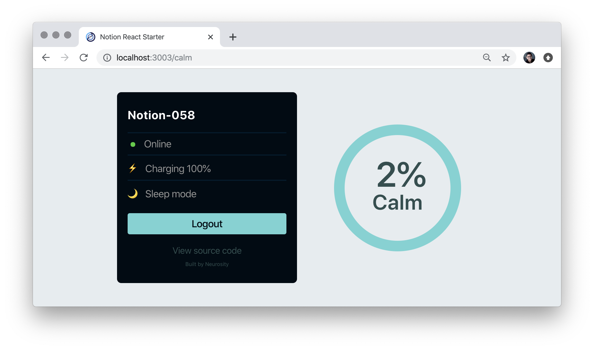

# 🚀 Notion React Starter

### Getting Started

- 1️⃣ `git clone https://github.com/neurosity/notion-react-starter.git`
- 2️⃣ `cd notion-react-starter`
- 3️⃣ `npm install`
- 4️⃣ `npm start`

### The Stack

- ⚛️ Built with React - [Create React App](https://github.com/facebook/create-react-app)
- 🏆 React Router - [react-router-dom](https://reactrouter.com)
- 🤯 NotionJS API - [@neurosity/notion](https://github.com/neurosity/notion-js)
- 🔑 NotionJS Authentication
- 👍 React Use - [react-use](https://github.com/streamich/react-use)

MIT License
