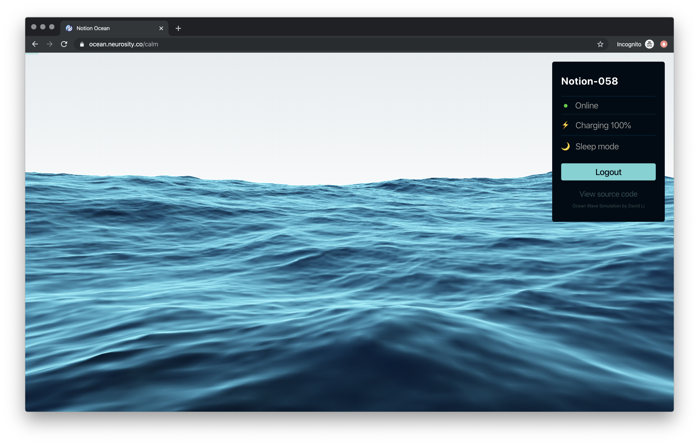

# Notion Ocean

This app uses [Notion](https://neurosity.co), the Neurosity brain computer to control the waves of the ocean based on your cognitive state. The idea is to influence the weather moving the ocean based on your calm state by changing the `choppiness`, `wind` and `size` properties of the ocean scene.

The calmer you get, the calmer the ocean gets. The experience starts with a wavy weather and the goal is to get the ocean to remain still by doing breath exercises, keeping your eyes closed or meditating.

### Tech Stack

- Built with React (hooks)
  - Bootstrapped with [Create React App](https://github.com/facebook/create-react-app).
- NotionJS API [(@neurosity/notion)](https://github.com/neurosity/notion-js)
  - Calm Metric `notion.calm()`
  - Device Status (`state, charging, battery & sleepMode`)
  - Device Info
- Auth via NotionJS
  - `login, logout, onAuthStateChanged`
- WebGL Ocean Simulation
  - By [David Li](https://david.li/)
- Deployed with Netlify

### MIT License
